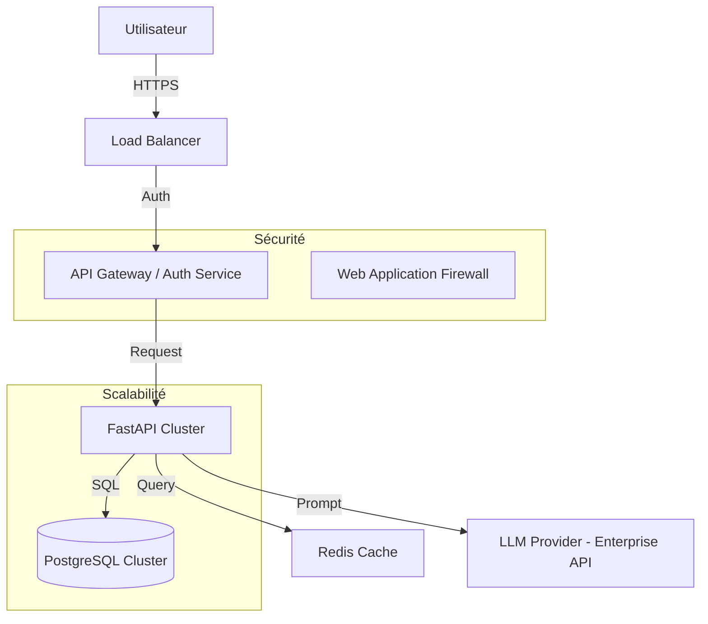

# Architecture & Réflexion

## 2.1 - Décisions techniques

### Choix du LLM et de l'Architecture
- **LLM (OpenRouter/Gemini 2.0 Flash)** : J'ai choisi OpenRouter car il offre une API unifiée pour accéder à de nombreux modèles. Le modèle Gemini 2.0 Flash a été sélectionné pour sa rapidité, sa gratuité (quota gratuit) et ses excellentes performances en génération de code SQL.
- **Backend (FastAPI)** : j'ai deja l'utiisée dans un projet de stage et FastAPI a été choisi pour sa rapidité d'exécution, sa gestion native de l'asynchrone et sa génération automatique de documentation (Swagger). C'est idéal pour un prototype qui doit être à la fois léger et extensible.
- **Frontend (Streamlit)** : Streamlit permet de créer une interface utilisateur fonctionnelle très rapidement en Python, ce qui est parfait pour démontrer les capacités de l'agent IA sans s'encombrer de développement web complexe.

### Compromis
- **Sécurité** : Pour ce prototype, la clé API est passée via l'interface ou un fichier `.env`. Dans une version de production, un système de gestion des secrets plus robuste serait nécessaire.
- **Complexité SQL** : L'agent génère du SQL brut. Bien que performant pour des requêtes simples, il pourrait rencontrer des difficultés sur des schémas extrêmement complexes sans une couche de métadonnées supplémentaire (Semantic Layer).

### Difficultés rencontrées
- La gestion des types de données entre SQLite (qui est assez flexible) et les attentes du LLM pour les dates a nécessité un prompt bien structuré pour éviter les erreurs de syntaxe SQL.
- crée l'interface avec streamlite
- trouvée la requtte parfait pour les deux llms
- faire les test unitaire et faire une simulation des appele des agents dans ces testes

## 2.2 - Améliorations proposées

### Fiabilité SQL
- **Few-shot Prompting** : Inclure des exemples de paires (Question, SQL) dans le prompt pour guider le LLM.
- **Validation de Schéma** : Utiliser une bibliothèque comme `sqlglot` pour valider la syntaxe SQL avant l'exécution.
- **Auto-correction** : Si une requête échoue, renvoyer l'erreur au LLM pour qu'il tente de la corriger.
- **stockée des requettes sql&Questions**: pour reduire le temps de reponse pour une question .

### Mémoire de l'Agent
- **Historique de Conversation** : Stocker les dernières interactions dans une base de données (ou session) pour permettre des questions de suivi (ex: "Et pour le mois d'après ?").
- **RAG (Retrieval Augmented Generation)** : Pour des schémas complexes, utiliser un système de recherche vectorielle pour ne fournir au LLM que les parties pertinentes du schéma.

### Scalabilité (1M+ lignes)
- **Indexation** : Ajouter des index sur les colonnes fréquemment filtrées (`customer_id`, `order_date`).
- **Read Replicas** : Utiliser des répliques en lecture pour ne pas impacter les performances de l'application principale.
- **Pagination** : S'assurer que l'agent ne tente jamais de récupérer 1M de lignes d'un coup en forçant des clauses `LIMIT`.
- diffirencier les question par un filtre comme categorie(s) pour simplifier pour l'agent de decouvrire les questions plus rapidement

## 2.3 - Schéma d'architecture (Production)

- **Sécurité** : Authentification JWT, chiffrement TLS, et isolation des données par client (Multi-tenancy) appliquée le protocole https.
- **Scalabilité** : Déploiement via Kubernetes (K8s) pour le backend et utilisation d'une base de données managée (ex: AWS RDS) avec auto-scaling.
- **Multi-clients** : Schémas de base de données séparés ou colonnes `client_id` avec Row Level Security (RLS).

j'ai choisie 2 llm un pour la requette sql et une pour la generation de la reponse exact 
# Modèle spécialisé pour le SQL (très précis sur la structure)
self.model_sql = "tngtech/deepseek-r1t2-chimera:free"
        
# Modèle spécialisé pour le langage naturel (plus fluide et "humain")
self.model_chat = "liquid/lfm-2.5-1.2b-thinking:free" 

